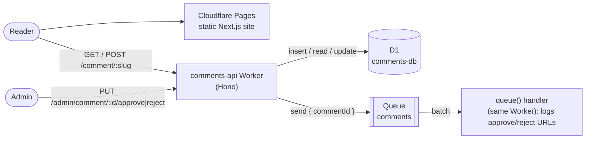

# MatTheDev

A personal developer blog with moderated reader comments, running entirely on Cloudflare.

- The **blog** is a static [Next.js](https://nextjs.org/) export. Posts are Markdown files rendered to HTML at build time and served from Cloudflare Pages.
- **Comments** are handled by a separate Cloudflare Worker (`comments-api`) backed by D1, and new comments are announced through a Cloudflare Queue for manual moderation.
- **Infrastructure** is created with Terraform, and both apps deploy with GitHub Actions.

## Features

**Blog**

- Posts written in GitHub-flavoured Markdown with front matter (title, date, description, tags, draft)
- Syntax-highlighted code blocks (Shiki) with light and dark themes that follow the reader's system setting
- Reading-time estimate and tags on each post
- Drafts show in local development but are left out of production builds
- Fully static: nothing runs on the server, so the site is cheap and fast to host

**Comments**

- Readers can leave a comment (name, title and comment) at the bottom of each post
- Input is validated on both the form and the API, and submissions are rate limited to 5 per minute per IP
- New comments are saved as `pending` and a message is queued, so posting stays fast
- The queue consumer logs each new comment with its approve and reject URLs, and every comment waits for manual approval
- Only approved comments are shown on the blog
- Approve and reject endpoints are protected by a bearer token
- The API only accepts browser requests from the blog's own origin (CORS)

## Architecture



The blog calls the Worker directly from the browser. The Worker's URL is baked into the site at build time through `NEXT_PUBLIC_COMMENTS_API_URL`.

An R2 bucket (`comments`, EU jurisdiction) is provisioned and bound to the Worker as `BUCKET`, ready for image attachments on comments. Nothing uses it yet.

## Repository layout

```
frontend/                 Next.js blog (static export, deployed to Cloudflare Pages)
  content/posts/          Markdown posts; the file name is the URL slug
  src/app/                App Router pages, the comments component and form, and the API client
  src/lib/                Post loading and Markdown rendering, site metadata
workers/comments-api/     Comments API Worker (Hono, TypeScript)
  migrations/             D1 schema migrations
  src/index.ts            HTTP routes (public, admin, CORS) and the queue consumer
  src/services/           D1 access
infra/                    Terraform: Pages project, D1 database, R2 bucket, queue and Worker
docs/                     Design notes (comments case study)
.github/workflows/        CI/CD: one workflow per deployable
```

## Writing a post

Add a Markdown file to `frontend/content/posts/`. The file name is the URL slug, so `my-post.md` is served at `/posts/my-post`.

```markdown
---
title: My post                  # required
date: 2026-09-25                # required, YYYY-MM-DD
description: One-line summary shown on the homepage.
tags: [dotnet, azure]
draft: true                     # optional: shown in `npm run dev`, left out of builds
---

Post content in GitHub-flavoured Markdown. Fenced code blocks are syntax highlighted.
```

Posts are rendered at build time, so a new post goes live when the site is next deployed (push to `master`). See `frontend/content/posts/hello-world.md` for an example.

## Local development

Run the API and the blog side by side.

**1. Comments API** (http://localhost:8787)

```bash
cd workers/comments-api
npm install
cp .dev.vars.example .dev.vars                          # set ADMIN_TOKEN; ALLOWED_ORIGIN=http://localhost:3000
npx wrangler d1 migrations apply comments-db --local    # create the local database
npm run dev
```

`wrangler dev` runs D1, the queue and the rate limiter locally, so nothing touches the real Cloudflare resources. Restart it after editing `.dev.vars`.

**2. Blog** (http://localhost:3000)

```bash
cd frontend
npm install
npm run dev
```

`frontend/.env.development` already points the blog at `http://localhost:8787`.

## Comments API

| Method | Path | Auth | Description |
|---|---|---|---|
| `GET` | `/comment/:slug` | none | Approved comments for a post, newest first (max 100) |
| `POST` | `/comment/:slug` | none | Submit a comment as JSON `{ author, title, body }`. Returns `202 { id }`, `400 { errors }` or `429` |
| `PUT` | `/admin/comment/:id/approve` | bearer | Approve a comment. Returns the updated comment or `404` |
| `PUT` | `/admin/comment/:id/reject` | bearer | Reject a comment. Returns the updated comment or `404` |

### Moderating comments

When a comment is submitted, the queue consumer logs its ID along with the approve and reject URLs. You can watch those logs with `npx wrangler tail comments-api`, or in the dashboard under Workers → `comments-api` → Logs. Then call:

```bash
curl -X PUT https://<comments-api-url>/admin/comment/<id>/approve \
  -H "Authorization: Bearer <ADMIN_TOKEN>"
```

### Database changes

Schema changes go in a new migration file. Don't edit one that has already been applied:

```bash
npx wrangler d1 migrations create comments-db <change_name>
npx wrangler d1 migrations apply comments-db --local
```

CI applies pending migrations to the remote database before each Worker deploy.

## Infrastructure

`infra/` is Terraform (Cloudflare provider v5). It creates:

- the Pages project `mm-website` (direct upload, with an optional custom domain and DNS record)
- the D1 database, with EU jurisdiction
- the R2 bucket, with EU jurisdiction
- the `comments` queue
- the `comments-api` Worker (the shell only; Wrangler deploys the code)

```bash
cd infra
cp terraform.tfvars.example terraform.tfvars   # set account_id (and optionally custom_domain/zone_id)
export CLOUDFLARE_API_TOKEN=...
terraform init
terraform plan -out=tfplan                     # dry run: review before applying
terraform apply tfplan
```

Terraform state is stored locally in `infra/` and is gitignored. Keep it safe, or configure a remote backend in `infra/versions.tf`. If a resource already exists in Cloudflare but not in state, bring it in with an `import` block rather than letting Terraform recreate it.

## Deployment

There are two GitHub Actions workflows, one for each deployable. Each only runs when its own folder changes.

| Workflow | Runs on changes to | Pull request | Push to `master` |
|---|---|---|---|
| `frontend-build.yml` | `frontend/**` | lint, build, Pages preview deployment | lint, build, production deployment |
| `comments-api-deploy.yml` | `workers/comments-api/**` | `wrangler deploy --dry-run` | apply D1 migrations, then deploy the Worker |

Keep API changes backward compatible (add first, remove later). The two workflows can run in parallel, so the blog may briefly be newer or older than the API.

### Required configuration

GitHub repository settings (**Settings → Secrets and variables → Actions**):

| Name | Type | Purpose |
|---|---|---|
| `CLOUDFLARE_API_TOKEN` | secret | API token with Pages, Workers Scripts, D1 and Queues edit permissions |
| `CLOUDFLARE_ACCOUNT_ID` | secret | Cloudflare account ID |
| `COMMENTS_API_URL` | variable | The Worker's public URL, built into the blog as `NEXT_PUBLIC_COMMENTS_API_URL` |

The Worker also needs its admin token, set once by hand. CI doesn't manage it, and it carries over between deploys:

```bash
cd workers/comments-api
npx wrangler secret put ADMIN_TOKEN
```

`ALLOWED_ORIGIN` in `workers/comments-api/wrangler.jsonc` must match the blog's production URL.

## Known limitations

- Moderation is manual only: there's no spam filtering, and new comments are only announced in the Worker's logs. Emails are planned, with retries and a dead-letter queue.
- CORS only allows the production origin, so Pages preview deployments can't load or post comments.
- Comments aren't re-fetched after submission, so newly approved comments appear on the next page load.
- Image attachments (R2) aren't implemented yet.
